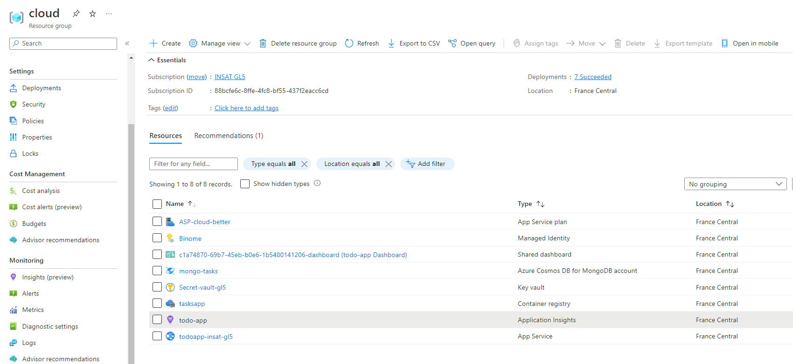

# Azure cloud computing project - TodoApp

- This project was made by Melek Elloumi and Yasmine Cherif
- We created a small TodoApp that creates and saves a list of todo tasks for its users.
- We used Microsoft Azure to develop and deploy the app using multiple services.
- These are the services we used:
    - App service
    - Azure IAM
    - Azure Cosmos DB
    - Azure Container Registry
    - Azure pipelines
    - Azure DevOps
    - Cost Management
    - Azure monitor (Application insights)
    - Azure Advisor

## Architecture

- This is the architecture of the deployment in Azure.

## TodoApp

- The app saves the tasks in the database and reload them for each user.

## Azure Services
We will now explain how we used each azure service.

### Ressource Groups
- Every ressource was created inside a single ressource group.
- We chose France Central as the Region for our ressources.
- We used tags to save metadata of our ressources and to facilitate their search. 

- We also secured the group with a delete ressource lock to avoid accidental deletion.

### Azure IAM (Identity and Access Management)
- We used this service to add users to the subscription and manage the roles.
- We have 1 user as owner and 1 user as contributor.

### Azure DevOps
- We used it to organize our work into tasks.
- We also used the integrated repository as a remote code repository for our app.

### Azure Pipelines
- We used this service to automatically build the app into an image and deliver it to an Azure Contrainer registry.
- It creates the necessary .yml file for the build pipeline.

### Azure Container Registry
- We created a container registry that will hold the app image and from where we will deploy the app.
- We used the standard pricing plan with 100 GB available.

### Azure Cosmos DB
- We used a NoSQL database with Azure Cosmos DB which holds a tasks collection.
- The connection string was updated into our app.
- We pay on the go depending on the number of request units.

### App service 
- We deploy the image from our Azure Container Registry into a web app service.
- After few seconds, the URL is available and we can use the app.
- We used a free tier Linux App service plan that gives us the ability to scale up the app when needed.
 

### Azure monitor 
- We added an application insight service to monitor our app after its deployment
- This will give us important metrics and let us observe its state.
 

### Cost Management
- We added a cost budget in Cost management service of 10$ for the month of December.
- Since our subscription has tight funds, we wanted to be alerted if the app depletes our ressources.
 

### Azure Advisor
- We used Advisor to check the recommendations to improve our usage and security.
- We are glad to find that everything is all right and according to the recommended settings.
 
